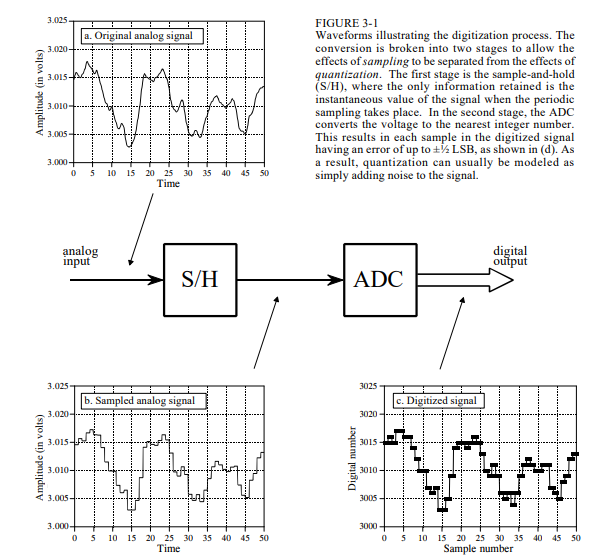

# Analog-to-Digital & Digital-to-Analog Conversion
ADC and DAC are the processes that allow our computers to interact with these everyday signals. Digital information is different from its continuous counterpart in two important respects: it is *sampled*, and it is *quantized*. This dictates the selection of the sampling frequency, number of bits, and type of analog filtering needed for converting between the analog and digital realms.

## Digitization Process
When digitizing signals, there are two part: Sample-and-Hold (S/H) and the Analog-to-Digital Converter (ADC). The sample-and-hold is to keep the voltage entering the ADC constant while the conversion is taking place. 

**Sampling** converts the *independent variable* (time in this example) from continuous to discrete. 

**Quantization** converts the *dependent variable* (voltage in this example) from continuous to discrete.

### Effects of the Quantization
Any sample in the digitized signal can have a maximum error of $\pm \frac{1}{2}$ **LSB (Least Significant Bit)**.

The digital output will have the continuous input plus a quantization error. In most cases, the results will have a specific amount of random noise to the signal. The additive noise is uniformly distributed between $\pm \frac{1}{2}$ LSB, mean of 0, and a standard deviation of $\frac{1}{\sqrt{12}}$ LSB.
The *number of bits* determines the *precision* of the data. 
The random noise will simply add to whatever noise is already present in the signal during the quantization process. Let's say we have an analog signal with a maximum amplitude of $1.0 V$ and a random noise of $1.0 mV$ *rms*. To digitize this signal, the maximum value would be 255. So $1.0$ V would become 255 and $1.0mV$ would be 0.255 LSB.

The random noise are added by combining their *variances*: $\sqrt{A^2 + B^2} = C$ --> $\sqrt{0.255^2 + 0.29^2} = 0.386$ LSB. This is a 50% increase over the noise already in the analog signal. However, when we digitize this signal using 12-bits, there's virtually no increase in the noise. Here's two questions to help with your decision on how many bits the system needs:
1. How much noise is *already* present in the analog signal?
2. How much noise can be *tolerated* in the digital signal?

**Dithering** is a technique to improve the digitization process on slowly varying signals. A small amount of random noise is added to the analog signal. This sounds *counterintuitive* but it can help with certain situations. For example, there can be a constant analog signal that outputs 3.0001 volts making it $\frac{1}{10}$ of the way between the *digital value* of 3000 & 3001. If we were to take a sample of 10,000, we would get a sample of identical numbers with no fluctuation. If we added some dithering noise, 90% of the values will be 3000, but 10% will have a value of 3001. 

Circuits for dithering can be difficult and complex, then passing the signal through a DAC to produce the added noise. The computer can subtract random numbers from the digital signal using floating point arithmetic. This is called **subtractive dither**. The simplest method is to use the noise that's present in the signal but that's not always possible.

