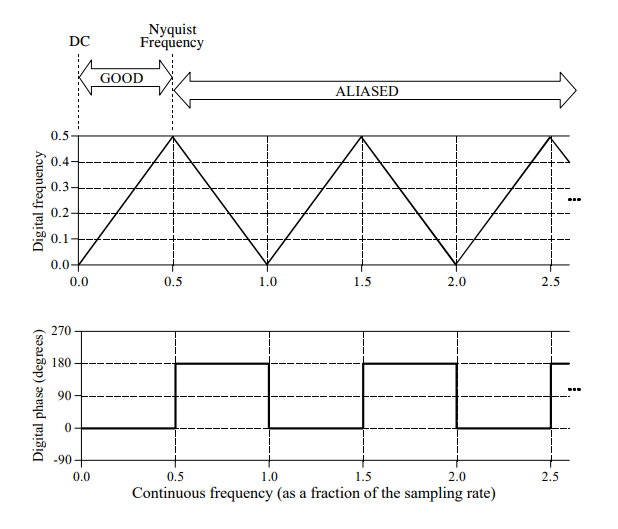
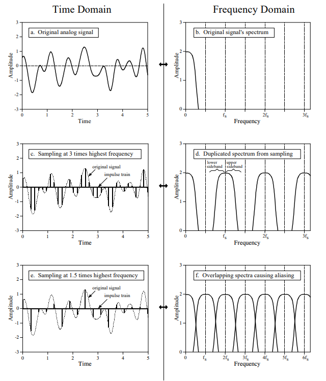

# Analog-to-Digital & Digital-to-Analog Conversion
ADC and DAC are the processes that allow our computers to interact with these everyday signals. Digital information is different from its continuous counterpart in two important respects: it is *sampled*, and it is *quantized*. This dictates the selection of the sampling frequency, number of bits, and type of analog filtering needed for converting between the analog and digital realms.

## Digitization Process
When digitizing signals, there are two part: Sample-and-Hold (S/H) and the Analog-to-Digital Converter (ADC). The sample-and-hold is to keep the voltage entering the ADC constant while the conversion is taking place. 

**Sampling** converts the *independent variable* (time in this example) from continuous to discrete. 

**Quantization** converts the *dependent variable* (voltage in this example) from continuous to discrete.

### Effects of the Quantization
Any sample in the digitized signal can have a maximum error of $\pm \frac{1}{2}$ **LSB (Least Significant Bit)**.

The digital output will have the continuous input plus a quantization error. In most cases, the results will have a specific amount of random noise to the signal. The additive noise is uniformly distributed between $\pm \frac{1}{2}$ LSB, mean of 0, and a standard deviation of $\frac{1}{\sqrt{12}}$ LSB.
The *number of bits* determines the *precision* of the data. 
The random noise will simply add to whatever noise is already present in the signal during the quantization process. Let's say we have an analog signal with a maximum amplitude of $1.0 V$ and a random noise of $1.0 mV$ *rms*. To digitize this signal, the maximum value would be 255. So $1.0$ V would become 255 and $1.0mV$ would be 0.255 LSB.

The random noise are added by combining their *variances*: $\sqrt{A^2 + B^2} = C$ --> $\sqrt{0.255^2 + 0.29^2} = 0.386$ LSB. This is a 50% increase over the noise already in the analog signal. However, when we digitize this signal using 12-bits, there's virtually no increase in the noise. Here's two questions to help with your decision on how many bits the system needs:
1. How much noise is *already* present in the analog signal?
2. How much noise can be *tolerated* in the digital signal?

**Dithering** is a technique to improve the digitization process on slowly varying signals. A small amount of random noise is added to the analog signal. This sounds *counterintuitive* but it can help with certain situations. For example, there can be a constant analog signal that outputs 3.0001 volts making it $\frac{1}{10}$ of the way between the *digital value* of 3000 & 3001. If we were to take a sample of 10,000, we would get a sample of identical numbers with no fluctuation. If we added some dithering noise, 90% of the values will be 3000, but 10% will have a value of 3001. 

Circuits for dithering can be difficult and complex, then passing the signal through a DAC to produce the added noise. The computer can subtract random numbers from the digital signal using floating point arithmetic. This is called **subtractive dither**. The simplest method is to use the noise that's present in the signal but that's not always possible.

## The Sampling Theorem
**Proper Sampling** is done when you can *reconstruct* the analog signal from your digital signal. If the key information has been captured if you can reverse the process even though some data are missing or unusual.

In the figure below, we will demonstrate what can happen when sampling an analog signal. The line represents the analog signal going into the ADC and the square markers are the digital data from the output of the ADC. In each graph, we increase the analog signal's frequency. In graph (a) and (b), we see that the digital data correlates well with the analog signal. Users can see the shape and the amplitude of the analog signal from using the digital data. We can easily replicate the signal and therefore these two data have *proper sampling*. Another way of defining proper sampling can be how these patterns are unique and only correspond to only one analog signal. In graph (c), it may seem like the sampling is improper. But since no other signal can reproduce the same result, this counts as *proper sampling*. The last graph shows the frequency being 0.95 of the sampling rate. We can see that the digital data can represent a different sine wave. This sine wave can represented as a sine wave of 0.05 frequency in the digital data. This is called **aliasing**, similar to how a person can have an *alias* or an assumed name. Since another analog signal can represent this digital signal, this would be called **improper sampling**.

When discussing the sampling theorem, there are two terms: **Nyquist Frequency** and the **Nyquist Rate**. There's no standard definition for these terms. Let's say there's an analog signal with a frequency between DC and 3 kHz. To quantize this signal, we need to choose a sample rate of 6000 samples/sec or higher. 

If we choose to sample at 8000 samples/sec, this allows frequencies between DC and 4kHz to be properly represented. There four important frequencies:
1. The highest frequency in the signal -> 3kHz
2. Twice this frequency, 6kHz
3. The sampling rate, 8kHz
4. One-half the sampling, 4kHz

Which of these four is the *Nyquist Frequency* and the *Nyquist Rate*? It depends and most authors are careful to define how they are using th terms. Both terms in the book mean *one-half the sampling rate*. The key point to remember is that a digital signal *cannot* contain frequencies above the $\frac{1}{2}$ sampling rate. 

When *aliasing* happens, the frequency cannot go above the one-half sampling rate. If it's below the *Nyquist Rate*, the data matches but if it's above the rate, then it becomes a mirror of its frequency. As you can see in figure below, the zigzag in the top graph shows that the sampling after the *Nyquist Freqeuncy* can be appear to be a different frequency. Let's say you are sampling at 1000 Hz and therefore the *Nyquist Frequency* is 500 Hz. This means an 800 Hz, 1200 Hz, and a 1800 Hz signal can appear as 200 Hz in the digital data. 

Another effect aliasing has on the sampled data is the *phase*. As you can see in the figure above, the aliasing had introduced an 180&deg;F phase shift between $0.5f$&rarr;$1.0f$, $1.5f$ &rarr; $2.0f$, and $2.5f$. This would be an inversion of the signal.

### Impulse Train
An **impulse train** is a continuous signal with a series of narrow spikes (impulses) that match the original signal at that instantaneous time. 

When sampling a continuous signal creates multiple impulses at certain peaks. In (c), the sampled frequency was 3 times the continuous frequency. We can also see the frequency domain respectively. We can see the *duplication* of the spectrum of the original signal. The copy is called **upper sideband** and the flipped copy is called the **lower sideband**. This counts as *proper sampling* since the signal in (c) can be converted back into the signal in (a) by taking out all frequencies above $\frac{1}{2}f_s$ ~ an analog low-pass filter.

## Digital-to-Analog Conversion
A simple method to convert the digital signals back to an analog signal would be to use a low-pass filter with the cutoff frequency equal to $\frac{1}{2}$ of *sampling rate*. While this works in theory, it is hard to replicate impulse trains in electronics so therefore DACs implement a technique called **zeroth-order hold**. They would sample and hold the value until the next sample comes in. It's called *zeroth-order* since *first-order* would mean straight lines between the points and a *second-order* would have a parabola between samples. 

Mathematically, the zeroth-order hold results by having the impulse train multiplied by the curve in (d) given by this equation:
$$$
H(f) = 
$$$

