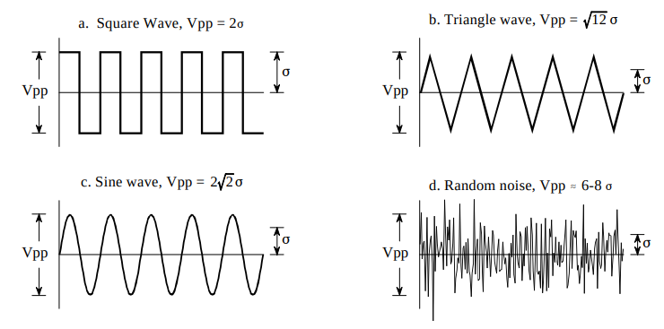
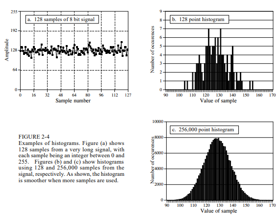
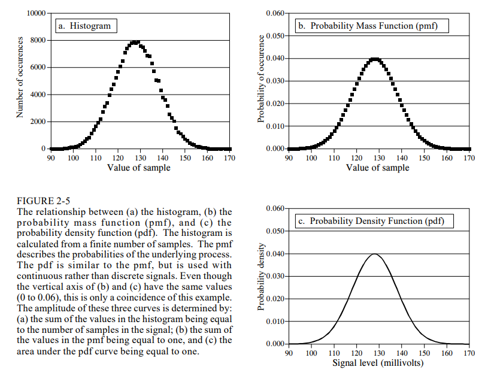
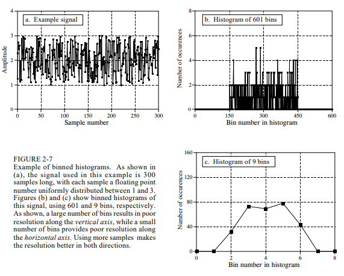
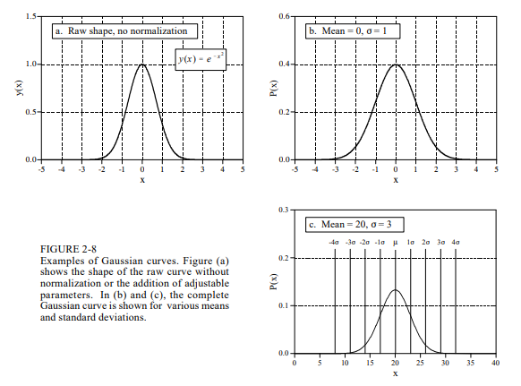
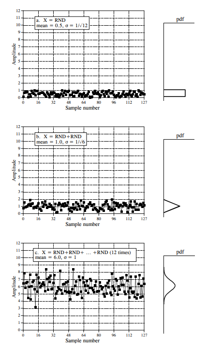

# Chapter 2: Statistics, Probability and Noise
In this chapter, we briefly go over statistics and probability. When processing signals, we need to reduce interference, noise, and other unnecessary data. Statistics and probability helps remove these disruptive components and how they apply to the acquired signals.

## Terminologies
A **signal** is a description of how one parameter depends on another parameter. For example, we can measure the voltage over time, when time extends, we can see how it is changing. The **independent variable** is the values that doesn't depend on any other variable (usually the x-axis, time, domain, sample number). The **dependent variable** is the measurement you get from the independent variable (usually the y-axis, range, ordinate).

A **continuous signal** is when both of these parameters are assumed to have a continuous range of values. An example would be the *voltage* that varies with *time*.

A **discrete/digitized signal** is when both parameters are *quantized*. Imagine the conversion from an analog-to-digital signal. Since values in a computer have limits we would need to convert it into the limits in range. So if we have a 12-bit number with a sampling rate of 1000 samples per second. The voltage is curtailed to 4096 ($2^{12}$) possible binary values.

**Domain** is widely used in DSP:
1. *Time Domain* = time as an independent variable
2. *Frequency Domain* = frequency as an independent variable
3. *Spatial Domain* = Distance as an independent variable

When graphing discrete signals, we label the horizontal axis as the **sample number**. We represent the number of sample number with *N*. Each sample would have its own *sample number* or *index*. 

Figure 1: An example of what a discrete signal would look like.

## Mean and Standard Deviation
The **mean** indicated by $\mu$ (Greek Letter *mu*) is the average value of a signal:

$$
\mu = \frac{1}{N} \sum_{i=0}^{N-1} x_i
$$

In electronics, the *mean* can be called the **DC** (direct current) value and **AC** (alternating current) refers to how the signal fluctuates around the mean value. Most signals do not have a well-defined peak-to-peak value like in Figure 1.

To describe how far the $i^{th}$ sample *deviates* from the mean we use this expression: 
$$
\sigma = |x_i - \mu|
$$
The *average deviation* of a signal is found by summing the deviations of all individual samples then dividing it by the number of samples *N*. We take the absolute value because if we added together the positive and negative deviation it would be close to zero. The *average deviation* is almost never used in statistics. Since we don't care about the *deviation* part but the *power* represented by the deviation from the mean. For example, when random noise signals combine in an electronic circuit, the resultant noise is equal to the combined power/effect of the individual signals, not their combined *amplitude*. 

The **standard deviation** is a measure of how far the signal fluctuates from the mean. The expression for the standard deviation is this:
$$
\sigma ^2 = \frac{1}{N-1} \sum_{i=0}^{N-1} (x_i - \mu)^2
$$
The term, $\sigma^2$, is given the name **variance** which represents the power of this fluctuation.

By definition, the standard deviation measures the **AC** portion of a signal while the **RMS* values measures both the *AC* and *DC* components. If a signal has no DC component, its RMS value is identical to the standard deviation. Here is a representation of the relationship between standard deviation and peak-to-peak value of common waveforms.

While the method of the variance equation is used for running statistics, it is not efficient when translated to computer code. A solution to this problem is to use this equation:
$$
\sigma ^2 = \frac{1}{N-1} [\sum_{i=0}^{N-1}x_i^2 - \frac{1}{N}(\sum_{i=0}^{N-1}x_i)^2]
$$

While moving through the signal, some parameters are recorded:
1. Number of samples
2. The sum of these samples
3. The sum of the squares of the samples

These parameters have been recorded to calculate the mean and standard deviation using the current value of these three parameters.
In some situations, the *mean* describes what is being measured, while the *standard deviation* represents noise and other interference.

## Signal vs. Underlying Process
**Statistics** is the science of interpreting *numerical data* and in comparison **probability** is used in DSP to understand the *processes* that generate signals. Although they are closely related, the distinction between the **acquired signal** and the **underlying process** is key to many DSP techniques.

When flipping a coin 1000 times, the mean won't always be at 0.5. Random chance will create results that are slightly different each time. Even if *probability* is constant, the *statistics* of the acquired signal change each time the experiment is repeated. This is called **statistical variation/fluctuation/noise**.

For random signals, the typical error between the mean of the *N* points, and the mean of the underlying process, is given by:
$$
\text{Typical Error} = \frac{\sigma}{\sqrt{N}}
$$

If *N* is small, the noise in the calculated mean will be very large. In other words, you do not have access to enough data to properly characterize the process. The larger the value of *N*, the smaller the expected error will become. According to the *Strong Law of Large Numbers*, it guarantees that the error becomes zero as *N* approaches infinity.

## Histogram, PMF, & PDF
The **histogram** displays the *number of samples* there are in a signal that have each of its possible values.

We will represent the histogram by $H_i$, where *i* is an index that runs from 0 to *M*-1, and *M* is the number of possible values that each sample can take on. For example, $H_50$ is the number of samples that have a value of 50. As you can see, the larger the sample size the more smoother it appears. The statistical noise of the histogram is inversely proportional to the square root of the number of samples used. The number of samples is equal to the sum of all samples in the histogram.
$$
N= \sum_{i=0}^{M-1} H_i
$$

The histogram can be used to efficiently calculate the mean and standard deviation of very large data sets. Histograms groups samples together that have the same value and this allows the statistics to be calculated with a smaller group rather than a large number of individual samples. Using this approach the mean and standard deviation can be calculated with these equations:
$$
\mu = \frac{1}{N} \sum_{i=0}^{M-1} iH_i
$$
$$
\sigma^2 = \frac{1}{N-1} \sum_{i=0}{M-1} (i - \mu)^2 H_i
$$

The histogram is what is formed from an acquired signal. The corresponding curve for the underlying process is called the **probability mass function (pmf)**. A histogram is always calculated using a finite number of samples, while the pmf is what *would* be obtained with an infinite number of samples. We can think of it as the *probability* that a certain value will be generated based on this sample.

The alternative for a continuous signal is the **probability density/distribution function (pdf)**. The vertical axis unit is the probability density rather than the probability. Fro example, a pdf of 0.03 at 120.5mV *does not* mean that a voltage of 120.5mV will occur 3% of the time. The probability that a voltage will be exactly 120.5000mV is extremely low. To calculate a probability, the *probability density* is multiplied by a *range* of values. If the pdf is not constant oer the range of interest, the multiplication becomes the *integral* of the pdf over that range.

A problem that can occur is when calculating the histogram the number of levels each sample can take on is much larger than the number of samples in the signal. A solution to this problem is called **binning**. We will be arbitrarily selecting the length of the histogram to be some convenient number, such as 1000 points, often called **bins**. The value of each bin represents the total number of samples in the signal that have a value within a *certain range*. 

Deciding how many bins should be used is a compromise. Too many bins makes it difficult to estimate *amplitude* of the underlying pmf and too few bins makes it difficult to estimate the underlying pmf in the *horizontal* direction. You can see an example from this:

## The Normal Distribution
Most random signals will have a bell-shaped curve in its *pdf*. This can be called **Normal Distribution**, a **Gauss Distribution**, or a **Gaussian**.

The basic shape of the curve is generated from a *negative squared exponent* but adding the mean and standard deviation gives a general equation for the distribution. Note that the total area under the curve is equal to *one*:
$$
P(x) = \frac{1}{\sigma\sqrt{2\pi}}e^{\frac{-(x-\mu)^2}{2\sigma^2}}
$$

We can see the effects of the mean and standard deviation to the distribution curve. The *mean* will control where the center of the curve is at while the *standard deviation* will control how wide the bell shape goes. 

The **cumulative distribution function (cdf)** is going to be the integral of the distribution between a range of values. It uses the upper-case Greek symbol *phi* $\Phi$. For example, $\Phi(1) = 0.038$ means that there's a 3.8% probability that the value of the signal will be between $-\infty$ to two *standard deviation* below the *mean* at any given time. To figure out the probability that the signal will be between two *values* is to subtract the appropriate numbers in $\Phi(x)$ table. The probability of a signal is gonna be between 1 standard deviation and two standard deviation away from the mean is:
$\Phi(1) - \Phi(-2) = 0.8413$ means it will be 84.13%.

## Digital Noise Generation
In signal processing, we will discuss much about random noise. It is also important to discuss **random number generators**. Many languages will have its own *pseudo-random* number generator. This means the numbers are already *pre-determined* using a **seed** value. A random number generator can get a random number using this seed resulting in a new number between 0 and 1:
$$
R = (aS + b)\mod {c}
$$

In most cases, we can observe that when random signals come together, they usually will have a Gaussian distribution. In the figure below we can see that as we add two random signals indicated as $X = RND + RND$. 

We see in the first graph $X = RND$. Its mean is 0.5 and the standard deviation is $\frac{1}{\sqrt{12}}$ and its distribution is *uniform* between 0 & 1.
As we add a second random nature to the first signal, we see that the mean increases to *1.0* since each random number can go from 0 to 1 and the sum can go from 0 to 2. The standard deviation changed to $\frac{1}{\sqrt{6}}$ because when independent random signals are added, its variance are also added. We can see the distribution changed from an uniform distribution to a triangular distribution. When we take this a step further, we see that this changes to a bell-shaped curve or a *Gaussian Distribution*. This is called the **Central Limit Theorem** which states a sum of random numbers becomes normally distributed as more and more of the random numbers are added together. It explains why we see so many examples of these in nature.

In the second method we can create a normal distribution equation using $R_1$ and $R_2$:
$$
X = (-2 \log{R_1})^{1/2} cos(2\pi R_2)
$$

## Precision and Accuracy
Here we will define some terms that are used to describe methods or systems. The **true value** or the **truth** is the actual value of a signal.

A **measured value** is the value obtained by the signal and you would want the measured value to be as close to the true value. The *precision* and *accuracy* is based on the errors between these two values. As an example, let's say we send a sonic wave into the ocean. Sound waves mostly travel at a constant speed in the water which makes surveying easier using the elapsed time it takes for the signal to return. However, there can be noise from different sources: random noise, waves on ocean surface or animals swimming. 

We can investigate these measurements by taking readings that are *exactly* 1000 meters deep and set that as our *true value*. we can plot these values on a histogram. First the mean may be shifted from the true value. This shift is called **accuracy** of the measurement. In individual measurements may not agree well with each other like the width of the distribution. This would be the **precision** of the measurement and it's expressed by quoting the standard deviation, the signal-to-noise ratio or the CV.

**Random errors** are errors that change each time the measurement is repeated and the precision is a measure of random noise.

**Systematic errors** are errors that become repeated when repeating experiments. Accuracy is usually dependent on how you *calibrate* the system. 