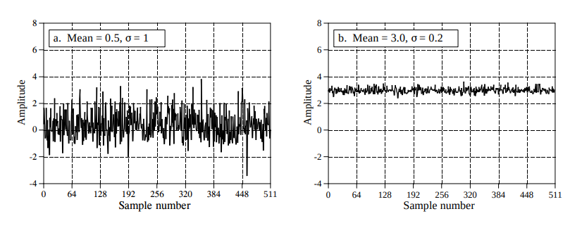

# Chapter 2: Statistics, Probability and Noise
In this chapter, we briefly go over statistics and probability. When processing signals, we need to reduce interference, noise, and other unnecessary data. Statistics and probability helps remove these disruptive components and how they apply to the acquired signals.

## Terminologies
A **signal** is a description of how one parameter depends on another parameter. For example, we can measure the voltage over time, when time extends, we can see how it is changing. The **independent variable** is the values that doesn't depend on any other variable (usually the x-axis, time, domain, sample number). The **dependent variable** is the measurement you get from the indepedent variable (usually the y-axis, range, ordinate).

A **continuous signal** is when both of these parameters are assumed to habe a continuous range of values. An example would be the *voltage* that varies with *time*.

A **discrete/digitized signal** is when both parameters are *quantized*. Imagine the conversion from an analog-to-digital signal. Since values in a computer have limits we would need to convert it into the limits in range. So if we have a 12-bit number with a sampling rate of 1000 samples per second. The voltage is curtailed to 4096 ($2^{12}$) possible binary values.

**Domain** is widely used in DSP:
1. *Time Domain* = time as an independent variable
2. *Frequency Domain* = freqeuncy as an independent variable
3. *Spatial Domain* = Distance as an independent variable

When graphing discrete signals, we label the horizontal axis as the **sample number**. We represent the number of sample number with *N*. Each sample would have its own *sample number* or *index*. 

Figure 1: An example of what a discrete signal would look like.

## Mean and Standard Deviation
The **mean** indicated by $\mu$ (Greek Letter *mu*) is the average value of a signal:

$$
\mu = \frac{1}{N} \sum_{i=0}^{N-1} x_i
$$

In electronics, the *mean* can be called the **DC** (direct current) value and **AC** (alternating current) refers to how the signal fluctuates around the mean value. Most signals do not have a well-defined peak-to-peak value like in Figure 1.

To describe how far the $i^{th}$ sample *deviates* from the mean we use this expression: 
$$
\sigma = |x_i - \mu|
$$
The *average devaition* of a signal is found by summing the deviations of all individual samples then dividing it by the number of samples *N*. We take the absolute value because if we added together the postive and negative deviation it would be close to zero. The *average deviation* is almost never used in statistics. Since we don't care about the *deviation* part but the *power* represented by the deviation from the mean. For example, when random noise signals combine in an electronic circuit, the resultant noise is equal to the combined power/effect of the individual signals, not their combined *amplitude*. 

The **standard deviation** is a measure of how far the signal fluctuates from the mean. The expression for the standard devation is this:
$$
\sigma ^2 = \frac{1}{N-1} \sum_{i=0}^{N-1} (x_i - \mu)^2
$$
The term, $\sigma^2$, is given the name **variance** which represents the power of this fluctuation.

By definition, the standrd deviation measures the **AC** portion of a signal while the **RMS* values measures both the *AC* and *DC* components. If a signal has no DC component, its RMS value is identical to the standard deviation. Here is a representation of the relationship between standard deviation and peak-to-peak value of common waveforms.

While the method of the variance equation is used for running statistics, it is not efficient when translated to computer code. A solution to this problem is to use this equation:
$$
\sigma ^2 = \frac{1}{N-1} [\sum_{i=0}^{N-1}x_i^2 - \frac{1}{N}(\sum_{i=0}^{N-1}x_i)^2]
$$

While moving through the signal, some parameters are recorded:
1. Number of samples
2. The sum of these samples
3. The sum of the squares of the samples

These parameters have been recorded to calculate the mean and standard deviation using the current value of these three parameters.
In some situations, the *mean* describes what is being measured, while the *standard deviation* represents noise and other interference.

## Signal vs. Underlying Process
**Statistics** is the science of interpreting *numerical data* and in comparison **probability** is used in DSP to understand the *processes* that generate signals. Although they are closely related, the distinction between the **acquired signal** and the **underlying process** is key to many DSP techniques.

When flipping a coin 1000 times, the mean won't always be at 0.5. Random chance will create results that are slightly different each time. Even if *probability* is constant, the *statistics* of the acquired signal change each time the experiment is repeated. This is called **statistical variation/fluctuation/noise**.

For random signals, the typical error between the mean of the *N* points, and the mean of the underlying process, is given by:
$$
\text{Typical Error} = \frac{\sigma}{\sqrt{N}}
$$

If *N* is small, the noise in the calculated mean will be very large. In other words, you do not have access to enough data to properly characterize the process. The larger the value of *N*, the smaller the expected error will become. According to the *Strong Law of Large Numbers*, it guarantees that the error becomes zero as *N* approaches infinity.
